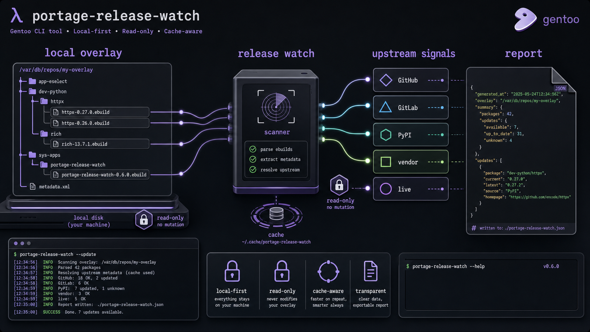
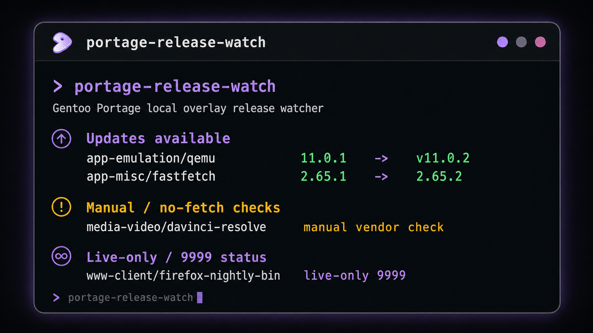
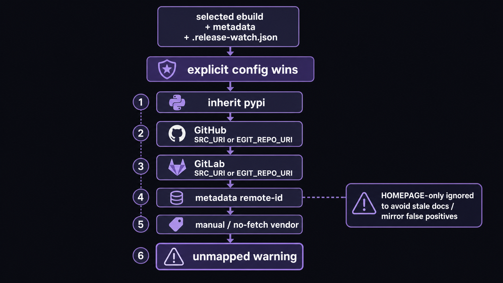
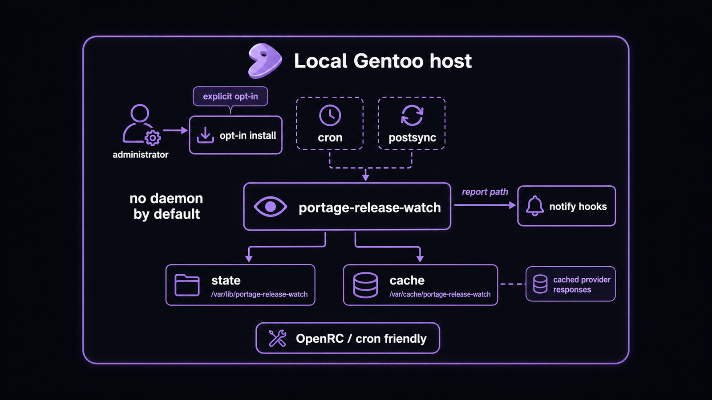

# portage-release-watch

`portage-release-watch` is a Gentoo Portage release watcher for local overlays. It scans ebuilds in a local Portage repository, infers upstream release sources, compares local `PV`/`PVR` with upstream versions using Gentoo Portage version semantics, and writes both human-readable and JSON reports.

<p align="center">
  
</p>

<p align="center"><em>Local-first release intelligence for Gentoo maintainers: scan ebuilds, resolve upstreams, cache provider responses, and report without mutating your overlay.</em></p>


## What it does

This tool is a Gentoo overlay release checker and Portage overlay upstream monitor. It answers: “which packages in my local overlay have newer upstream releases, which ones require manual/no-fetch vendor checks, and which `9999` live ebuilds are diverging from their fixed ebuild siblings?”

It provides local overlay upstream release notifications without mutating the overlay. It reads ebuilds and metadata, uses cache-aware provider API calls, and writes state under `/var/lib/portage-release-watch` in system mode or under the current user's XDG-like state/cache directories in unprivileged mode.

## Why Gentoo users use it

Gentoo local overlays often contain ebuilds copied from GitHub, GitLab, PyPI, proprietary vendor downloads, nightly channels, and one-off source archives. `emerge --sync` tells you the overlay synced; it does not tell you whether your private ebuilds track the latest upstream tag.

Use this when you maintain:

- an ebuild upstream version checker for a personal or team overlay;
- a GitHub release checker for ebuilds that use release assets;
- a GitHub tag checker for Gentoo packages that publish tags but not releases;
- a GitLab tag checker for Gentoo packages;
- a PyPI release checker for Gentoo packages;
- a 9999 ebuild monitor or live ebuild divergence checker;
- OpenRC cron release notifications after daily system maintenance;
- an `emerge --sync` postsync hook or `emaint sync` postsync hook;
- Gentoo package maintenance automation around a local Portage repository updater.

## Install

For a user-local CLI install directly from the public repository:

```sh
python -m pip install 'git+https://github.com/alpine-algo/portage-release-watch.git@v0.1.0'
```

If you prefer isolated CLI tools, `pipx` works too:

```sh
pipx install 'git+https://github.com/alpine-algo/portage-release-watch.git@v0.1.0'
```

The GitHub release also publishes wheel and source distribution artifacts for downstream packagers. Real release decisions on a Gentoo system require the Gentoo Portage Python API; non-Gentoo hosts are intended for tests, fixture parsing, and dry-run documentation.

## Quick start

From a checkout:

```sh
python -m pip install -e '.[test]'
portage-release-watch --overlay /path/to/local/overlay scan
portage-release-watch --overlay /path/to/local/overlay check
prw status
```

Without installation, run from the checkout with `PYTHONPATH=src`:

```sh
PYTHONPATH=src python -m portage_release_watch.cli --overlay /path/to/local/overlay scan
PYTHONPATH=src python -m portage_release_watch.cli --overlay /path/to/local/overlay check --json
```

System dry-run:

```sh
scripts/install-system.sh --dry-run --overlay /path/to/local/overlay --scheduler cron --postsync
```

A workstation-style install with daily cron and sync-time visibility is explicit:

```sh
sudo scripts/install-system.sh --overlay /path/to/local/overlay --scheduler cron --postsync
```

<p align="center">
  
</p>

<p align="center"><em>The human report separates ordinary updates from manual vendor checks and `9999` live-only packages.</em></p>

## Commands

```text
portage-release-watch scan [--json]
portage-release-watch check [--package CP] [--json] [--quiet] [--notify] [--refresh] [--no-write] [--fail-on-updates]
portage-release-watch list [--json]
portage-release-watch status [--json]
portage-release-watch details [--json]
portage-release-watch live [--json]
portage-release-watch explain CP
portage-release-watch install-system [OPTIONS]
portage-release-watch --version
prw ...
```

With no subcommand, the CLI defaults to `status`. `status`, `list`, `details`, and `live` read the selected cached report without discovering an overlay or making a network request, so they work from any current directory.

`check --package CP` prints an ephemeral package-scoped report. It does not replace the latest report or notice, append history, update notification state, invoke `logger`, or run notification hooks. Because partial results are never canonical notification state, `--package` cannot be combined with `--notify`.

`scan`, `check`, and `explain` require a recognized Portage overlay. An invalid path selected by `--overlay` or `PORTAGE_RELEASE_WATCH_OVERLAY` is an operational error rather than an empty successful scan. Use top-level or subcommand `--help` for option descriptions.

Exit codes:

- `0`: success, including a check that only used visible stale-cache fallback;
- `1`: an expected operational failure such as an invalid overlay, config, cached report, token file, install input, or any package row with provider status `failed`; this takes precedence over updates;
- `2`: invalid argparse command usage, or `check --fail-on-updates` found updates and no package row failed.

## How source discovery works

<p align="center">
  
</p>
<p align="center"><em>Source detection is deterministic: explicit package config wins, HOMEPAGE-only guesses stay ignored, and ambiguous vendor downloads become manual checks.</em></p>

Dynamic source discovery is enabled by default. Explicit config always wins. If no explicit package rule exists, the resolver uses this precedence:

1. `inherit pypi` in the selected ebuild;
2. GitHub source URLs or `EGIT_REPO_URI` from `SRC_URI`/fetch-related ebuild content;
3. GitLab source URLs from `SRC_URI`/fetch-related ebuild content;
4. `metadata.xml` `<remote-id>` entries for GitHub, GitLab, GNOME GitLab, and PyPI;
5. known proprietary/manual vendor URLs such as no-fetch download pages;
6. unmapped warning.

The scanner intentionally ignores `HOMEPAGE`-only links because those are often documentation, issue trackers, mirrors, or stale historical project pages. Prefer `.release-watch.json` for ambiguous packages instead of broad heuristics that guess from homepages.

## 9999 / live ebuild behavior

`9999` ebuilds do not have a normal fixed upstream version. The watcher handles them conservatively:

- If a CP has both a fixed ebuild and a `9999` ebuild, the newest fixed ebuild is compared against latest matched upstream and the report adds a `live_divergence` note.
- If a CP is live-only, fixed-release comparison is suppressed and the package is listed under live-only status.

Example:

```text
app-emulation/qemu                  11.0.1         -> v11.0.2  gitlab:gitlab.com/qemu-project/qemu
  live: 9999 ebuild present; fixed ebuild 11.0.1 trails latest matched release v11.0.2
```

This answers how far the fixed ebuild diverged while a live ebuild exists without pretending `9999` itself is outdated.

## Configuration

Config merge order is deterministic. Later files override earlier keys recursively for dictionaries:

1. built-in defaults;
2. `/etc/portage/release-watch.json`, if present;
3. `<overlay>/.release-watch.json`, if present;
4. `--config PATH`, if supplied.

Malformed or unreadable config files fail with a concise path-specific error. The schema remains version `2`; this milestone does not rewrite or migrate configuration.

Built-in defaults:

```json
{
  "schema_version": 2,
  "dynamic": { "enabled": true },
  "notify_repeat_hours": 168,
  "notify_hooks_dir": "/etc/portage/release-watch.notify.d",
  "packages": {}
}
```

See `examples/release-watch.json` for generic overrides covering prefixed upstream tags, opt-in prerelease tags, `.deb` control metadata, vendor URL/JSON regex checks, and live-only channels.

Overlay detection for `scan`, `check`, and `explain` uses this precedence:

1. `--overlay PATH`, which must name a recognized overlay;
2. `PORTAGE_RELEASE_WATCH_OVERLAY`, which must name a recognized overlay;
3. first ancestor of the current directory containing `profiles/repo_name` or root-level `repo_name` and at least one `*/*/*.ebuild`;
4. `/var/db/repos/local` when it is a recognized overlay;
5. otherwise an error asking for `--overlay /path/to/overlay`.

State/cache defaults:

- root/system mode: `/var/lib/portage-release-watch` and `/var/cache/portage-release-watch`;
- unprivileged mode: `~/.local/state/portage-release-watch` and `~/.cache/portage-release-watch`;
- overrides: `PORTAGE_RELEASE_WATCH_STATE` and `PORTAGE_RELEASE_WATCH_CACHE`.

## Scheduling and notifications

<p align="center">
  
</p>
<p align="center"><em>System integration is opt-in: package installation does not silently enable cron, postsync hooks, or notifications.</em></p>

`install-system` writes files only when explicitly invoked. Defaults are safe: `--scheduler none` and `--no-postsync`.

Options:

```text
--overlay PATH
--config PATH
--prefix PATH
--state-dir PATH
--cache-dir PATH
--notify-hooks-dir PATH
--scheduler cron|none
--postsync / --no-postsync
--alias-prw / --no-alias-prw
--dry-run
```

`--config` is optional. When omitted, the current installer behavior uses `/etc/portage/release-watch.json`; an explicit path remains distinguishable at the CLI parse boundary.

Daily cron uses `/etc/cron.daily/portage-release-watch` when `--scheduler cron` is requested. Sync-time visibility uses `/etc/portage/postsync.d/90-portage-release-watch` when `--postsync` is requested. The postsync hook uses a short timeout and the HTTP cache so a provider outage should not block normal sync workflows.

Notification dedupe repeats only when the update/manual/warning signal changes or `notify_repeat_hours` elapses. Executable hooks in `notify_hooks_dir` receive the report path as argv 1 and these environment variables:

```text
PORTAGE_RELEASE_WATCH_REPORT
PORTAGE_RELEASE_WATCH_STATUS
```

## GitHub rate limits and tokens

The default workload is small. JSON, text/HTML, and Debian binary provider responses share the HTTP cache's maximum age and ETag/Last-Modified revalidation policy. A fresh cache hit avoids the network; `check --refresh` attempts a fetch or revalidation for every provider type. For larger overlays or frequent refreshes, set a token:

```sh
export PORTAGE_RELEASE_WATCH_GITHUB_TOKEN=...
```

`GITHUB_TOKEN` is also honored. A config file may specify `github_token_file`, but public examples avoid machine-local token paths. When neither environment token is set, a configured token file must exist, be readable UTF-8, and contain a non-empty token; otherwise the command exits `1` without printing token content.

If a fetch or revalidation fails and a usable cached body exists, the package keeps its normal primary status and the current report adds a sanitized `stale_error` warning; a fresh hit, successful fetch, or `304` has no stale marker. Without usable cached data the package row is `failed`; `check` still emits and persists the full report before exiting `1`. Authentication tokens are not written to cache entries or failure text.

## Compatibility

This is Gentoo-first software. Real version comparison requires `sys-apps/portage` and the Gentoo Portage Python API (`portage.versions.vercmp`). If that API is unavailable when versions must be compared, the tool fails with a clear error instead of falling back to lexical ordering, because lexical comparison can produce false Gentoo version results.

Non-Gentoo Linux is supported only for unit tests, fixture parsing, dry-run documentation, and public CI portability. It is not promised to produce correct release decisions without the Gentoo Portage Python API.

## Packaging for Gentoo overlays

The project has no runtime Python dependencies beyond the standard library and Gentoo Portage. It uses a `src/` package layout and `hatchling` build backend. A downstream ebuild can install the console scripts `portage-release-watch` and `prw`, then optionally install cron/postsync hooks from `hooks/` or invoke `install-system` during local administrator setup.

Do not make package installation automatically enable cron or postsync. Those are administrator policy choices.

## Search keywords

In natural language, this project is a Gentoo Portage release watcher, Gentoo overlay release checker, and Portage overlay upstream monitor. It provides local overlay upstream release notifications, works as an ebuild upstream version checker, and covers GitHub release checker for ebuilds, GitHub tag checker for Gentoo packages, GitLab tag checker for Gentoo packages, and PyPI release checker for Gentoo packages workflows. It is also a 9999 ebuild monitor, live ebuild divergence checker, OpenRC cron release notifications helper, emerge --sync postsync hook, emaint sync postsync hook, Gentoo package maintenance automation utility, and local Portage repository updater companion.

## Development

```sh
python -m pip install -e '.[test]'
python -m pytest
python -m compileall src tests
```

CI runs the fixture suite on Ubuntu across Python 3.10, 3.11, 3.12, and 3.13. Tests that require a real Gentoo Portage Python API must skip with reason `requires Gentoo Portage Python API`; parser, inference, report, and installer dry-run tests use local fixtures and do not perform live GitHub/GitLab/PyPI network calls.

## License

MIT. See `LICENSE`.
